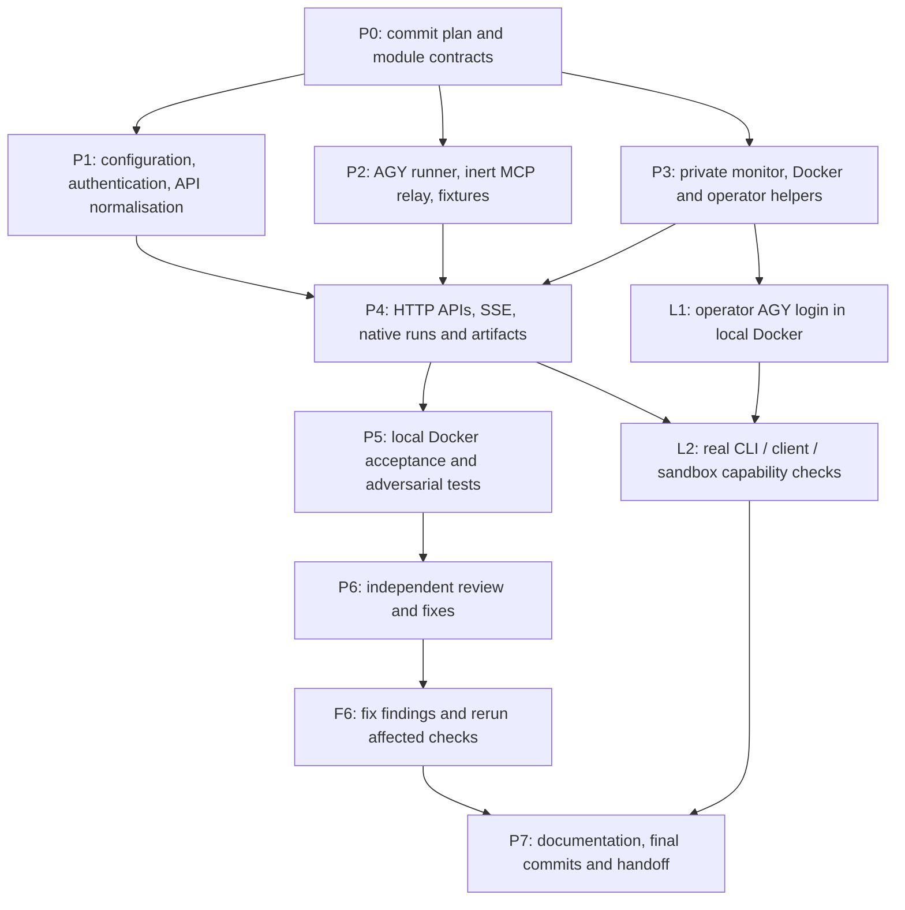

# Implementation plan

Status: local implementation, automated acceptance and authenticated SDK
acceptance complete. Full n8n/Hermes apps and native sandbox remain gated.
The implementation and validation use local Docker.

## Outcome

A Rust HTTP gateway over the official Antigravity `agy` CLI. It serves n8n,
Hermes, and ordinary OpenAI clients through a configurable API endpoint, while
an authenticated native API exposes CLI runs, progress, files, and artifacts.
An HTTPS reverse proxy can connect to the loopback-only Docker host port.
No Google token extraction, private backend calls, or paid-provider fallback.

## Decisions and limits

- Rust with Tokio/Axum; CLI subprocesses are the provider boundary.
- Pin AGY 1.2.15 initially. Verify its version and discover its model catalogue.
  Locally confirmed: `agy models` returns a text catalogue (not JSON), and
  `agy -p /quota --output-format json` returns structured quota/reset metadata.
- Chat Completions and Responses share normalisation, runner, cancellation,
  usage, errors, and streaming. Unsupported parameters fail explicitly; do not
  fabricate token usage, embeddings, or media support.
- Client tool calls use a private inert MCP relay: AGY selects a supplied tool,
  the router returns a structured call, and n8n/Hermes executes it. One call per
  turn initially; preserve full submitted history and stable call IDs.
- A native profile uses built-in AGY tools only with the official sandbox and
  a clean service configuration. Never enable broad permission skipping.
  Native tools must stay within the run's workspace; default-disable native
  execution until the operator completes the real sandbox verification gate.
- Native input files are explicitly uploaded; never fetch arbitrary input URLs
  or accept caller-controlled executable paths, shell arguments, MCP servers,
  hooks, or agent definitions. Artifact downloads are owner-scoped and reject
  traversal, symlinks, protected file patterns, and oversized files.
- CLI management/authentication commands are operator-only. Disable slash
  expansion on model prompts. Do not expose logout/configuration over HTTP.
- Model APIs are stateless: replay supplied messages. Native continuation, if
  offered, must use an owner-scoped router run ID, never a raw provider ID.
- Capabilities describe implemented adapters separately from live verification.
  Media endpoints remain unavailable until an actual headless path passes its
  own end-to-end acceptance check. Native artifact transport is generic.
- AGY login persists in a Docker named volume. Request workspaces are temporary
  Docker storage; artifacts have bounded retention and disappear on restart.
  Monitor metadata persists in a separate named volume, initially 30 days and
  50,000 events. No prompt, response, tool argument, header, or credential logs.
- Generate 64 random bytes per client key; store SHA-256 digests only and compare
  in constant time. Separate model/native scopes, rotation and revocation.
- Enforce bounded pre-authentication IP/global limits, authenticated per-key
  limits, request/header/body sizes, concurrency, queue admission, output sizes,
  run deadlines, and disconnect cancellation. Authenticate before runner work.
  Trust forwarded IPs only from explicitly configured proxy peers.
- Monitor through a mode-0600 Unix socket and `docker exec`; no public admin UI.
  Health reveals only liveness; readiness reflects actual CLI/auth status.
- Operator login: SSH to host, `docker exec -it` as the service user, run `agy`,
  complete the browser/code flow. Codex never reads credential files.

## DAG

P1/P2/P3 have separate file ownership and can run in parallel after P0.
P4 is integrated by the coordinator. Follow-up reviews are new DAG iterations
when fixes or failures justify them, rather than cyclic dependencies. L1 needs the user's interactive authentication, never secret-file
access by an agent. Work independent of L1 continues while that gate is pending.

## Deliverables and acceptance

| Node | Deliverable | Acceptance evidence |
| --- | --- | --- |
| P0 | This plan, interface contract, local commit | Clean ownership/dependency boundaries |
| P1 | Validated environment configuration, hashed keys, bounded rate limits, common OpenAI request types | Bad keys never launch AGY; proxy spoofing, excessive inputs, invalid tool/schema/parameter requests rejected |
| P2 | Subprocess supervisor, NDJSON decoder, model/quota probes, custom model agent, inert MCP server | Deterministic CLI fixtures exercise text, deltas, schema, tool handoff, provider errors, malformed output, timeout, child process cleanup and cancellation |
| P3 | Read-only terminal monitor, metadata retention, hardened Docker image/Compose, login/key/monitor helpers | Monitor works without public ports; container is nonroot, has no host folders/Docker socket, uses named volumes and loopback origin |
| P4 | `/health`, `/ready`, `/v1/models`, `/v1/capabilities`, `/v1/chat/completions`, `/v1/responses`, `/v1/agy/runs` and artifact routes | Streaming and nonstreaming contracts, ownership, bounded async jobs, cancellation, cleanup and honest usage |
| P5 | Rust and HTTP acceptance tests in local Docker, client compatibility probes | Both API styles complete a tool result/final answer loop; stable SSE IDs/events; saturation, isolation and failure cases pass |
| P6 | Independent security/protocol review | Findings fixed and relevant checks rerun |
| L1/L2 | Real authenticated CLI probes, restart/login persistence and native isolation evidence | Model/login checks completed in local Docker; full apps/native remain gated, with evidence in docs/validation.md |
| P7 | Working README, API examples, capability matrix, operations guide and local commits | Commands are reproducible; report tests and remaining operator gates accurately |

## Local tests and rollout gates

1. Use a synthetic fake AGY executable for deterministic adversarial tests.
   Only dummy credentials/files are used. Secret policy excludes `.env*`,
   `.pem`, `.key`, and all `secrets`/`credentials` directories from every scan,
   read, build context, artifact route, and test fixture inspection.
2. Build and run Rust checks using local Docker. Test fixtures must never fall
   back to the real signed-in CLI.
3. Build the actual AGY image and verify version plus unauthenticated readiness.
   Give the operator the local login command when authentication is needed.
4. With operator authentication, verify a fresh process, container restart and
   recreate retain the login; test text/schema/streaming/tool cycles, quotas,
   model discovery, and client disconnects. Test n8n/Hermes request contracts
   automatically and distinguish those probes from running the complete apps.
5. Verify native sandbox containment with synthetic canaries before enabling
   that profile. Sandbox unavailable or unverified means native generation is
   rejected, not silently run without containment.
6. Record per-version capability outcomes. Test new CLI versions before changing
   the pin. Measure startup/first-output/run latency before adding worker warming.
7. For deployment, follow the operations guide, choose an available loopback
   port, configure an HTTPS reverse proxy, and arrange volume backups.

## Research references

- [AGY headless protocol](https://www.antigravity.google/docs/cli/headless/)
- [AGY installation/authentication](https://www.antigravity.google/docs/cli/install/)
- [AGY permissions](https://www.antigravity.google/docs/permissions?tab=cli)
- [AGY terminal sandbox](https://www.antigravity.google/docs/sandbox?tab=cli)
- [n8n custom assistant model](https://docs.n8n.io/deploy/host-n8n/configure-n8n/set-up-n8n-assistant)
- [Hermes AGY adapter](https://hermes-agent.nousresearch.com/docs/plugins/antigravity-agy)
- [Hermes inert relay reference](https://github.com/Realtyxxx/hermes-plugin-antigravity-agy)
- [MLX endpoint/renderer architecture](https://github.com/cubist38/mlx-openai-server)

Community adapters inform the design; they do not prove our implementation's
compatibility. Official headless transport currently accepts text blocks only.

## Implementation record

- P0 complete: initial plan/interfaces committed before implementation.
- P1–P4 implemented: Rust validation/security, runner/relay, monitor/container,
  both API styles, async native jobs and safe artifact transport.
- P5 complete locally: fresh Docker build passed 70 Rust tests and 76 network /
  OpenAI Python SDK 3.24.0 / policy checks. Test state is separate from real login.
- The actual production image passed 13 unauthenticated smoke checks with
  disposable synthetic state and the pinned official Linux ARM64 CLI.
- P6/F6: independent cross-module reviews found and fixed startup policy,
  process cleanup/admission races, output/subscriber/body bounds, artifact
  hardlinks, early provider errors, MCP capture ordering, rejection-history
  load, preparation ownership and shutdown telemetry/cleanup. Focused final
  review approved the fixes; evidence is recorded in `docs/validation.md`.
- L1 complete: operator logged in using the official CLI inside local Docker.
- L2 model acceptance: 15 real OpenAI SDK 3.24.0 checks passed on Linux AGY
  1.2.15 / gemini-3.8-flash-low, including text, both streams/schemas, both
  client-tool loops and startup disconnect. Login survives restart/recreation;
  fresh Claude Sonnet text passed after restart. No auth files were examined.
- Live testing and review corrected global init-registry semantics, added
  zero-token parsed-agent preflight before user input, and replaced unreliable
  CLI model-schema behavior with independently validated generated JSON.
- P7 local documentation/commits delivered. Full installed n8n/Hermes apps and
  native OS containment remain unverified; native stays disabled under the
  current Docker restrictions.

Implementation refinements: native events are bounded to 2 MiB/4096 per run,
16 retained runs, two subscribers per run and eight heavy response streams.
Completed runs can be explicitly deleted. CLI-ready timing is measured from
request admission (so includes queue time); TTFT and total are separate metrics.
Workspaces are removed after process cleanup. Every CLI process has a dedicated
service HOME, private TMPDIR, cleared environment and self-update disabled.
Startup writes a fixed AGY settings policy and empty global MCP catalogue
without reading its saved login. Preflight rejection history is sampled while
fixed rejection counters include authenticated validation failures. Shutdown
drains admissions before its final metadata flush and reports cleanup failure.
