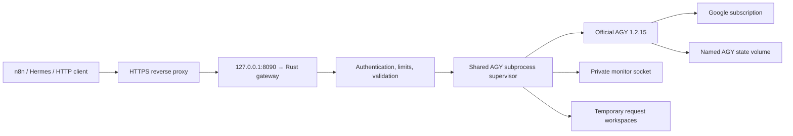

# ai-router

A Rust HTTP gateway over the official Antigravity (`agy`) CLI. It is intended
for n8n, Hermes, and OpenAI-compatible applications using an existing Google
AI Pro login. Google authentication stays inside the official CLI.

See [PLAN.md](PLAN.md) for the implementation plan and design decisions.

## Architecture



Both OpenAI API styles share one runner. Model requests replay submitted
history in a fresh workspace, use a fixed agent without default components,
and disable slash expansion. A zero-token CLI management check verifies the
parsed custom agent before user prompts are sent. A private inert MCP relay offers client-supplied
tools: it captures one validated call, stops AGY, and returns `tool_calls` or a
Responses `function_call`. The client executes the tool and sends its result
with the full history. No client tool runs on this server.

Native runs are separate and require a `native` key scope. They expose
structured CLI progress, explicitly uploaded files, and owner-scoped artifacts.
Native execution is disabled until real sandbox containment has been verified.
No host directories, Docker socket, or arbitrary caller-defined MCP servers,
hooks, agents, executable paths, or CLI arguments are exposed.

## Quick start in local Docker

Docker is required; host Rust and Python are not required.

```sh
docker build --target gateway -t ai-router:local .
./scripts/keygen.sh n8n model
```

Key generation shows an 86-character random API key to the operator once and
prints its digest record as JSON. Save the raw key in the client. Export only
an array of digest records in the shell used to start Docker:

```sh
export AI_ROUTER_KEYS='[{"id":"n8n","sha256":"REPLACE_WITH_GENERATED_DIGEST","scopes":["model"]}]'
docker compose --env-file /dev/null up -d
./scripts/login.sh --remote
```

The placeholder must be replaced with the generated 64-hex-character digest.
For Hermes, generate another client key and include its digest record in the
array. The service refuses missing or malformed key configuration. Never put
a Google login token into gateway configuration.

Use `--env-file /dev/null` on every Compose command to prevent implicit loading
of a local dotenv file. This repository does not use dotenv or an `env_file`.

The login helper runs official AGY interactively as UID 10001 with the same
home directory as gateway workers. `--remote` selects its browser/code flow.
After login, readiness refreshes within 60 seconds:

```sh
curl --fail http://127.0.0.1:8090/health
curl --fail http://127.0.0.1:8090/ready
./scripts/monitor.sh --text --range 1h
```

An optional auth-only helper container can share this volume. Remove that
helper before starting the gateway; preserve the `ai-router-auth` volume.

[Operations, login, rotation, monitoring, and verification](docs/operations.md)
cover the full procedure. No SSH daemon is installed in the container: SSH to
the host, then use `docker exec`.

## Client configuration

For local evaluation, use `http://127.0.0.1:8090/v1`. For remote access,
configure an HTTPS reverse proxy on your own domain with the loopback origin
as its upstream. Keep the Docker origin bound to host loopback.

```text
Base URL: https://ai.example.com/v1
API key: the key generated for that client
Model: an ID returned by GET /v1/models
```

The gateway listens on `0.0.0.0:8080` inside its container; Compose publishes
only `127.0.0.1:8090` on the host. `AI_ROUTER_PORT` selects a different host port.
Port availability must be checked separately before future server integration.

For the n8n Assistant, set the custom model endpoint and API key according to
[its configuration guide](https://docs.n8n.io/deploy/host-n8n/configure-n8n/set-up-n8n-assistant).
Its separate assistant sandbox is still required. For Hermes, select its
OpenAI-compatible/custom endpoint provider and a discovered model ID.

The gateway rejects active sampling controls such as `temperature` and `top_p`.
Responses `max_output_tokens` and Chat `max_tokens` or `max_completion_tokens`
accept positive integer budgets as **best-effort answer-length instructions**.
AGY has no verified hard generation-token cap: answers may exceed the requested
budget, and these fields do not cap reasoning tokens or account usage. Output,
JSON and tool calls are never cut to fit the hint, and reported usage remains
the actual provider usage. Successful budget-bearing responses include
`X-AI-Router-Token-Budget-Mode: prompt-guidance`; `/v1/capabilities` reports the
same limitation. Omitted/null budgets add no instructions. Supplying both Chat
budget fields is rejected. This allows n8n's built-in connection probe, which
always sets a token budget, to reach the provider.
Parallel tool calls are permitted in requests, but this adapter returns at most
one call per turn. Forced/required tool selection is currently unsupported.

In n8n Chat, select tools for the current conversation; creating a tool in the
library alone does not attach it to an existing chat. Each gateway request
uses its current supplied client-tool catalogue, including an empty catalogue.
AGY native tools such as `manage_task` are not available client tools. The
model is instructed to answer tool-inventory questions from the current
catalogue. Container `model_request` logs record client-tool names/count so
missing selections can be diagnosed without logging prompts or tool arguments.

## HTTP API

Every `/v1` route requires `Authorization: Bearer <client-key>`.

| Route | Behaviour |
| --- | --- |
| `GET /health` | Minimal public liveness, no provider details |
| `GET /ready` | Minimal readiness; 503 when CLI/auth probe is unavailable |
| `GET /v1/models` | Discovered catalogue from the pinned official CLI |
| `GET /v1/capabilities` | Adapter capabilities, limitations, quota freshness, verification gates |
| `POST /v1/chat/completions` | Text, streaming, client tools, final structured output |
| `POST /v1/responses` | Same runner, Responses objects and typed SSE events |
| `POST /v1/agy/runs` | Owner-scoped asynchronous native run; disabled by default |
| `GET /v1/agy/runs/{id}` | Run status and result |
| `DELETE /v1/agy/runs/{id}` | Cancel an active run; delete a terminal run and its workspace |
| `GET /v1/agy/runs/{id}/events` | Bounded SSE event replay; `Last-Event-ID` supported |
| `GET /v1/agy/runs/{id}/artifacts` | List safe files after a successful run |
| `GET /v1/agy/runs/{id}/artifacts/{path}` | Download a safe, bounded artifact |

Responses are stateless and use `store:false`; retrieval, background Responses,
and raw provider conversation resumption are unsupported. Streaming preserves
stable completion/item/call IDs, terminal status, and cancellation. Before SSE
starts, failures use ordinary HTTP error responses. After SSE starts, failures
use terminal error events and never transparently retry a run.

Model JSON Schema requests instruct the model to return raw JSON, then validate
the complete final value in Rust. Invalid JSON or schema failures return an
error; provisional schema output is withheld. This is validated generated text,
without a guarantee of provider constrained decoding.

Native request shape, available only after operator verification:

```json
{
  "model": "a-discovered-model-id",
  "prompt": "Summarise input/notes.txt and write summary.txt",
  "mode": "plan",
  "effort": "medium",
  "files": [{"path":"notes.txt","data_base64":"U3ludGhldGljIG5vdGVz"}]
}
```

`mode` may be `plan` or `accept-edits`; omit it for the CLI default. `effort` is
model-dependent. `json_schema` accepts a validated schema object. Uploads are
staged under `input/`; generated artifacts must remain in the workspace.
Protected file names, hidden configuration, traversal, symlinks and hardlinks
are not served. Caller-provided URLs are never fetched for inputs.

Native history is limited to 16 retained runs, 2 MiB of events and 4096 events
per run, two event subscribers per run, and eight simultaneous native response
bodies. Workspaces expire after one hour by default or disappear on restart.
The completed native API does not establish that every built-in tool or media
feature works headlessly; use the [capability matrix](docs/capabilities.md).

## Security and storage

- Each API key contains 64 cryptographically random bytes. Configuration stores
  SHA-256 digests only; comparisons use constant-time digest comparison.
- Global/IP admission runs before key lookup; per-key limits and scopes follow.
  Authentication precedes body parsing, schema checks and generation.
- Body/header/output bounds, a ten-second body deadline, bounded read slots,
  concurrency, queue limits and run deadlines prevent unbounded backend work.
- Forwarded IPs are ignored unless `AI_ROUTER_TRUSTED_PROXIES` lists the exact
  connecting proxy IP. That proxy must overwrite `X-Real-IP`; arbitrary
  forwarding chains are not trusted.
- CLI workers use a clean service home and cleared environment, fixed policy,
  separate private workspaces, and the official sandbox flag. Provider stdout,
  stderr and tool handoffs are bounded. Cancellation kills the process group.
- Model requests use a fixed custom agent with no built-ins and at most the
  inert client-tool relay. AGY's initial tool list is its global registry:
  the adapter checks the exact pinned inventory, and rejects every actual
  native tool or subagent step. Live canaries verify the effective isolation.
- Named volumes preserve AGY state and monitor metadata. Temporary workspaces
  use tmpfs. AGY itself can persist conversations/logs in its state home: the
  AGY volume is sensitive, not a promise of login-only storage.
- Router telemetry contains request IDs, client IDs, models, timings, errors
  and observed usage, never prompts, completions, arguments or auth headers.
  Incomplete usage is marked partial; missing usage is null, not invented zero.
- Rejection counters count attempts since startup. Detailed preflight rejection
  records are sampled at 30 per minute, keeping sustained rejected traffic from
  overwhelming the monitor history or forcing expensive persistence work.
  Authenticated handler failures follow the normal per-key/global limits.
- The monitor uses a mode-0600 Unix socket inside the container. No public
  administration or provider-management endpoint exists.

Default limits: 60 pre-auth requests per IP/minute, 600 globally/minute,
30 per key/minute, 2 active generations, 8 waiting, a 1 MiB body, 8 MiB provider
output, and a 120-second run deadline. Limits are configurable and validated.
Native stays off in the shipped Compose file. Docker's default seccomp may
prevent the CLI sandbox from starting; do not solve that by granting unrestricted
privileges. See the native verification gate in the operations guide.

## Testing

```sh
./scripts/test-local.sh
```

The local suite builds and tests in Docker, uses an explicit synthetic fake AGY,
exercises the actual Rust MCP relay, runs network/client contract checks, and
uses disposable test state separate from the login volume. Fixtures never
fall back to the signed-in host CLI. See [validation evidence](docs/validation.md)
for the commands/results and the remaining authenticated checks.

The local suite passes 70 Rust tests and 76 HTTP/SDK checks. Authenticated
acceptance also passes 15 live SDK checks for Gemini text, both API styles,
streams, JSON Schema and client-owned tool loops. AGY login survives restart
and container recreation; Claude text also passes after restart. Running the
complete installed n8n/Hermes applications and enabling the native sandbox
remain separate operator validation gates.

The secret-file policy applies to every tool and build context: `.env*`, `.pem`,
`.key`, and contents of `secrets` or `credentials` directories are excluded.
Policy tests use synthetic files only; credentials are never copied or examined.
